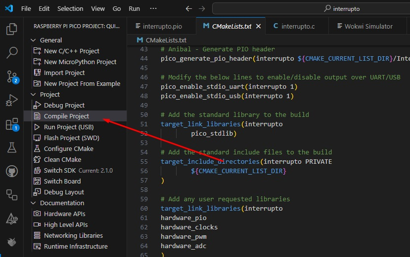

## Raspberry Pi Pico W e PWM

Este projeto implementa o controle de um servomotor usando o Raspberry Pi Pico W e PWM, simulando no Wokwi.
Tambem controla a intensidade da luminosidade de um LED

🎥 Demonstração

Confira a execução do código no vídeo abaixo:

🔗 Link de Youtube: [https://youtu.be/tSzL9VdP0N0](https://youtu.be/tSzL9VdP0N0)

## Resultados no uso do Led:

O LED no ambiente Wokwi não apresentou modificação na intensidade. No entanto, na placa BitDogLab, é possível notar que, na frequência de 50 Hz, não é possível perceber que o LED está piscando 50 vezes por segundo. Inicialmente, o brilho do LED muda em três escalas, que não são tão nítidas: muito fraco (durante 5 segundos), menos fraco (durante 5 segundos) e não tão fraco (durante 5 segundos). Após esses 15 segundos, não há mais escalas de 5 segundos. Em loop, o brilho diminui e aumenta suavemente, sem parar.

## 📌 Requisitos
- *Hardware*: Simulado no Wokwi
- *Software*:
  - [VS Code](https://code.visualstudio.com/)
  - [Pico SDK](https://github.com/raspberrypi/pico-sdk)
  - [Wokwi](https://wokwi.com/)
  - [GitHub](https://github.com/)

## 🛠️ Configuração do Ambiente
1. Instale o *Pico SDK* e configure no VS Code.
2. Clone este repositório:
   ```bash
   git clone https://github.com/seu-usuario/nome-do-repositorio.git
   

3. Compile o código, no SDK do VS code aperte em compilar segundo imagem:
   
   

4. Envie para a placa BitDogLab utilizando o ambiente de desenvolvimento adequado para ver a mudança de intensidade do LED RGB azul.

5. Rode no wokwi integrado ao vscode abrindo o arquivo diagram.json e apertando no botão Run da extensão do Wokwi.

📜 Código-Fonte

O código está no arquivo main.c e utiliza PWM na GPIO 22 para controlar o ângulo do servomotor.

🔧 Funcionamento

1. Define frequência PWM de 50Hz.


2. Posiciona o servo em 180°, 90° e 0° com pausas de 5s.


3. Implementa movimento suave entre 0° e 180° com passos de 5µs.


4. Aciona o LED RGB na GPIO 12 durante o experimento.


📂 Estrutura do Projeto

├── src/
│   ├── main.c
│   ├── CMakeLists.txt
├── wokwi/
│   ├── diagram.json
├── README.md


📌 Como Rodar no Wokwi

1. Abra o Wokwi.


2. Importe o arquivo diagram.json.


3. Carregue e rode o código.
